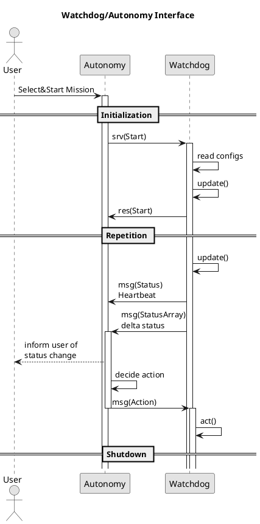

### Watchdog State Machine

```plantuml
@startuml

skinparam monochrome true
scale max 1000*1000

title Watchdog/Autonomy Interface

actor User
participant Autonomy
participant Watchdog

User->Autonomy++: Select&Start Mission

== Initialization ==

Autonomy->Watchdog++: srv(Start)
Watchdog->Watchdog: read configs
Watchdog->Watchdog: update()
Watchdog->Autonomy: res(Start)

== Repetition ==

Watchdog->Watchdog: update()
Watchdog->Autonomy: msg(Status)\nHeartbeat
Watchdog->Autonomy ++: msg(StatusArray)\ndelta status
Autonomy-->User: inform user of\nstatus change
Autonomy->Autonomy: decide action
Autonomy->Watchdog--++: msg(Action)
Watchdog->Watchdog: act()

== Shutdown ==


@enduml
```
