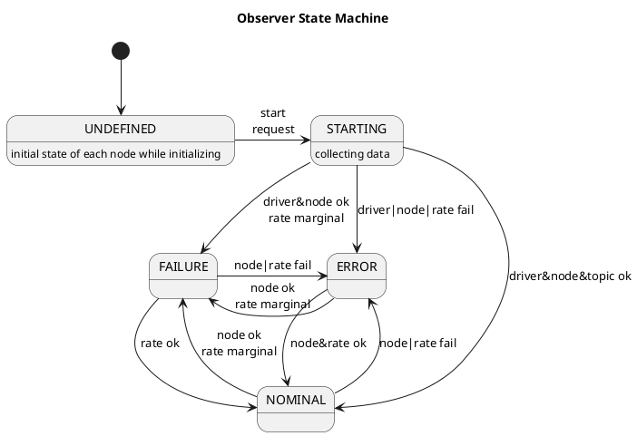
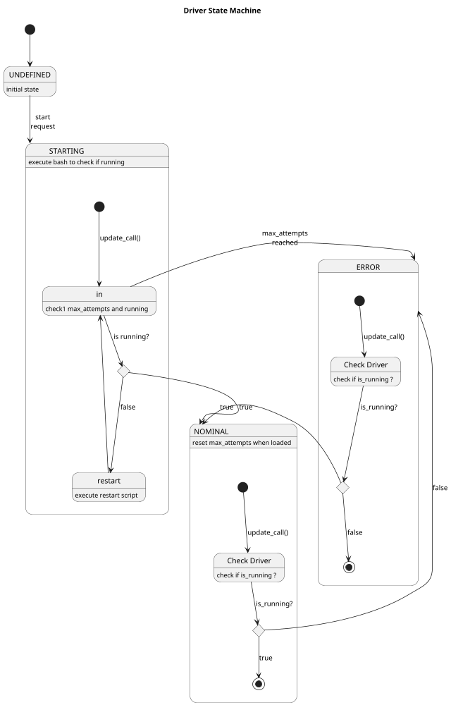

### Watchdog State Machine

```plantuml
@startuml

'skinparam monochrome true
scale max 1000*1000

title Observer State Machine

state "UNDEFINED" as undef
state "STARTING" as start
state "NOMINAL" as nominal
state "ERROR" as error
state "FAILURE" as fail

[*] --> undef
undef : initial state of each node while initializing

undef -> start : start\nrequest
start : collecting data

start --> nominal : driver&node&topic ok
start --> fail: driver&node ok\nrate marginal
start --> error : driver|node|rate fail

nominal --> error : node|rate fail
nominal --> fail : node ok\nrate marginal

fail -> error : node|rate fail
fail --> nominal : rate ok

error --> nominal : node&rate ok
error -> fail : node ok\nrate marginal

@enduml
```

```plantuml
@startuml

skinparam monochrome true
scale max 1000*1000

title Driver State Machine

state "UNDEFINED" as undef
state "STARTING" as start

state "STARTING" as start{
  state "init" as in
  state check1 <<choice>>
  state in : check1 max_attempts and running
  state restart : execute restart script
  [*] --> in : update_call()
  in --> check1 : is running?
  check1 --> restart : false
  restart --> in
}
state "NOMINAL" as nominal {
  state check2 <<choice>>
  state "Check Driver" as incheck2
  incheck2: check if is_running ?
  [*] --> incheck2 : update_call()
  incheck2 --> check2 : is_running?
  check2 --> [*] : true
}
nominal: reset max_attempts when loaded

state "ERROR" as error {
  state check3 <<choice>>
  state "Check Driver" as incheck3
  incheck3: check if is_running ?
  [*] --> incheck3 : update_call()
  incheck3 --> check3 : is_running?
  check3 --> [*] : false
}

'state "FAILURE" as fail

check1 --> nominal : true
check2 -> error : false
check3 --> nominal : true
in -> error : max_attempts\nreached

[*] --> undef
undef : initial state
undef --> start : start\nrequest
start : execute bash to check if running


@enduml
```
