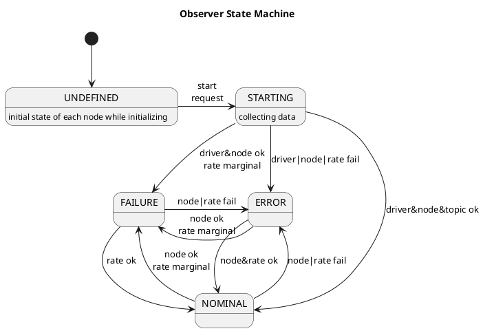
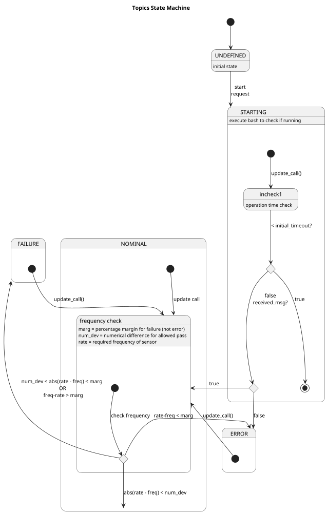
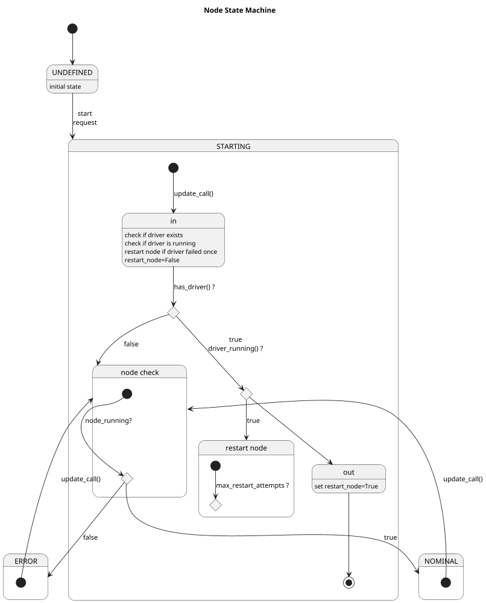
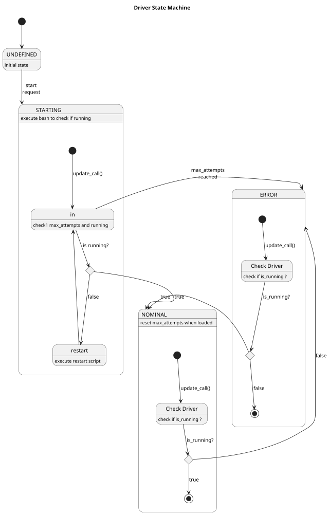

### Watchdog State Machine

```plantuml
@startuml

'skinparam monochrome true
scale max 1000*1000

title Observer State Machine

state "UNDEFINED" as undef
state "STARTING" as start
state "NOMINAL" as nominal
state "ERROR" as error
state "FAILURE" as fail

[*] --> undef
undef : initial state of each node while initializing

undef -> start : start\nrequest
start : collecting data

start --> nominal : driver&node&topic ok
start --> fail: driver&node ok\nrate marginal
start --> error : driver|node|rate fail

nominal --> error : node|rate fail
nominal --> fail : node ok\nrate marginal

fail -> error : node|rate fail
fail --> nominal : rate ok

error --> nominal : node&rate ok
error -> fail : node ok\nrate marginal

@enduml
```

```plantuml
@startuml

skinparam monochrome true
scale max 1000*1000

title Topics State Machine

state "UNDEFINED" as undef
state "STARTING" as start

state "STARTING" as start{
  state "init" as incheck1
  state check11 <<choice>>
  state check12 <<choice>>
  state incheck1 : operation time check
  [*] --> incheck1 : update_call()
  incheck1 --> check11 : < initial_timeout?
  check11 --> [*] : true
  check11 --> check12: false\nreceived_msg?
}
state "NOMINAL" as nominal {
  [*] --> freq: update call
}

state "ERROR" as error {
  [*] --> freq: update_call()
}
state "FAILURE" as fail

state "frequency check" as freq {
  state check51 <<choice>>
  [*] --> check51: check frequency
}
freq: marg = percentage margin for failure (not error)
freq: num_dev = numerical difference for allowed pass
freq: rate = required frequency of sensor

state "FAILURE" as fail {
  [*] --> freq:update_call()
}

check12 --> error: false
check12 -> freq: true

check51 --> error: rate-freq < marg
check51 --> nominal : abs(rate - freq) < num_dev
check51 --> fail : num_dev < abs(rate - freq) < marg \n OR \n freq-rate > marg

'check2 --> error : false
'check3 --> nominal : true
'in -> error : max_attempts\nreached

[*] --> undef
undef : initial state
undef --> start : start\nrequest
start : execute bash to check if running

@enduml
```

```plantuml
@startuml

skinparam monochrome true
scale max 1000*1000

title Node State Machine

state "UNDEFINED" as undef
state "STARTING" as start

state "STARTING" as start{
  state "in" as in21
  in21: check if driver exists
  in21: check if driver is running
  in21: restart node if driver failed once
  in21: restart_node=False

  state "out" as out22
  out22 : set restart_node=True

  state check21 <<choice>>
  state check22 <<choice>>

  [*] --> in21 : update_call()

  in21 --> check21: has_driver() ?
  check21 --> node: false
  check21 --> check22: true\ndriver_running() ?

  check22 --> restart: true
  check22 --> out22
  out22 --> [*]
}
state "NOMINAL" as nominal {
  [*] --> node: update_call()
}
state "ERROR" as error {
  [*] --> node: update_call()
}

state "node check" as node {
  state check51 <<choice>>
  [*] --> check51: node_running?
}

state "restart node" as restart {
  state check63 <<choice>>

  [*] --> check63: max_restart_attempts ?
  check63: 
}

check51 --> nominal: true
check51 --> error: false

[*] --> undef
undef : initial state
undef --> start : start\nrequest

@enduml
```

```plantuml
@startuml

skinparam monochrome true
scale max 1000*1000

title Driver State Machine

state "UNDEFINED" as undef
state "STARTING" as start

state "STARTING" as start{
  state "init" as in
  state check1 <<choice>>
  state in : check1 max_attempts and running
  state restart : execute restart script
  [*] --> in : update_call()
  in --> check1 : is running?
  check1 --> restart : false
  restart --> in
}
state "NOMINAL" as nominal {
  state check2 <<choice>>
  state "Check Driver" as incheck2
  incheck2: check if is_running ?
  [*] --> incheck2 : update_call()
  incheck2 --> check2 : is_running?
  check2 --> [*] : true
}
nominal: reset max_attempts when loaded

state "ERROR" as error {
  state check3 <<choice>>
  state "Check Driver" as incheck3
  incheck3: check if is_running ?
  [*] --> incheck3 : update_call()
  incheck3 --> check3 : is_running?
  check3 --> [*] : false
}

'state "FAILURE" as fail

check1 --> nominal : true
check2 -> error : false
check3 --> nominal : true
in -> error : max_attempts\nreached

[*] --> undef
undef : initial state
undef --> start : start\nrequest
start : execute bash to check if running

@enduml
```
