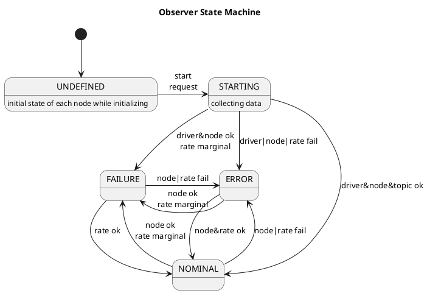
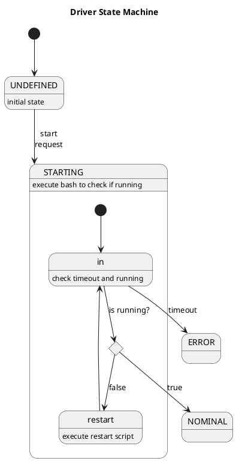

### Watchdog State Machine

```plantuml
@startuml

'skinparam monochrome true
scale max 1000*1000

title Observer State Machine

state "UNDEFINED" as undef
state "STARTING" as start
state "NOMINAL" as nominal
state "ERROR" as error
state "FAILURE" as fail

[*] --> undef
undef : initial state of each node while initializing

undef -> start : start\nrequest
start : collecting data

start --> nominal : driver&node&topic ok
start --> fail: driver&node ok\nrate marginal
start --> error : driver|node|rate fail

nominal --> error : node|rate fail
nominal --> fail : node ok\nrate marginal

fail -> error : node|rate fail
fail --> nominal : rate ok

error --> nominal : node&rate ok
error -> fail : node ok\nrate marginal

@enduml
```

```plantuml
@startuml

skinparam monochrome true
scale max 1000*1000

title Driver State Machine

state "UNDEFINED" as undef
state "STARTING" as start{
  state "init" as in
  state check <<choice>>
  state in : check timeout and running
  state restart : execute restart script
  [*] --> in
  in --> check : is running?
  check --> restart : false
  restart --> in
}
state "NOMINAL" as nominal
state "ERROR" as error
'state "FAILURE" as fail


check --> nominal : true


[*] --> undef
undef : initial state

undef --> start : start\nrequest
start : execute bash to check if running


in --> error : timeout


@enduml
```
